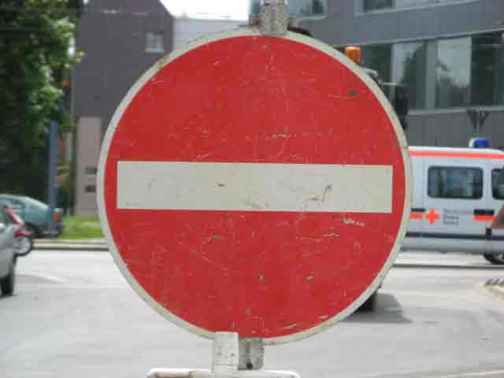

#**Traffic Sign Recognition** 

##Writeup Template

###You can use this file as a template for your writeup if you want to submit it as a markdown file, but feel free to use some other method and submit a pdf if you prefer.

---

**Build a Traffic Sign Recognition Project**

The goals / steps of this project are the following:

* Load the data set (see below for links to the project data set)
* Explore, summarize and visualize the data set
* Design, train and test a model architecture
* Use the model to make predictions on new images
* Analyze the softmax probabilities of the new images
* Summarize the results with a written report

[//]: # (Image References)

[image1]: ./writeup/dataset_distribution.png "dataset histogram"
[image2]: ./writeup/training_examples.png "training examples"
[image3]: ./writeup/gray_processing.png "Grayscale"
[image4]: ./web_test/web_test1.jpg "Traffic Sign 1"
[image5]: ./web_test/web_test2.jpeg "Traffic Sign 2"
[image6]: ./web_test/web_test3.jpeg "Traffic Sign 3"
[image7]: ./web_test/web_test4.jpg "Traffic Sign 4"
[image8]: ./web_test/web_test5.jpg "Traffic Sign 5"

## Rubric Points
###Here I will consider the [rubric points](https://review.udacity.com/#!/rubrics/481/view) individually and describe how I addressed each point in my implementation.  

---
###Writeup / README

####1. Provide a Writeup / README that includes all the rubric points and how you addressed each one. You can submit your writeup as markdown or pdf. You can use this template as a guide for writing the report. The submission includes the project code.

You're reading it! and here is a link to my [project code](./Traffic_Sign_Classifier.ipynb)

###Data Set Summary & Exploration

####1. Provide a basic summary of the data set. In the code, the analysis should be done using python, numpy and/or pandas methods rather than hardcoding results manually.

I used the pandas library to calculate summary statistics of the traffic
signs data set:

* The size of training set is ? 34799
* The size of the validation set is ? 4410
* The size of test set is ? 12630
* The shape of a traffic sign image is ? (32, 32)
* The number of unique classes/labels in the data set is ? 43

####2. Include an exploratory visualization of the dataset.

Here is an exploratory visualization of the data set. It is a bar chart showing how the data set distribute over classes.  As shown in the chart, class 0, 43 and others has small size of training data -- below 250 examples, while classes 1 and 2 have more than 1800 examples in training data.

![alt text][image1]

Moreover, below is the overview about one training dataset example per classes.  It is found that some images are too dark/the contrast is not clear, such as case 13, 23 and so on. It is hard to recognize these images even by nake eyes. So, in my opinion, to increase the constrast of theses images would enhance the accuracy of CNN. So histogram equalization is applied on these images to enhance contrast.  Please refer to preprocess.

![alt text][image2]

###Design and Test a Model Architecture

####1. Describe how you preprocessed the image data. What techniques were chosen and why did you choose these techniques? Consider including images showing the output of each preprocessing technique. Pre-processing refers to techniques such as converting to grayscale, normalization, etc. (OPTIONAL: As described in the "Stand Out Suggestions" part of the rubric, if you generated additional data for training, describe why you decided to generate additional data, how you generated the data, and provide example images of the additional data. Then describe the characteristics of the augmented training set like number of images in the set, number of images for each class, etc.)

As a first step, Histogram equalization process is applied to enhance image contrast. So shown above, some images are too dark and cannot recognize the pattern. 

Histogram Equalization Wiki: [link]https://en.wikipedia.org/wiki/Histogram_equalization

I decided to convert the images to grayscale because the image color varies signicantly in training dataset.  It probably is affected by the light environment where taking these pictures.  On the other side, the gray of images would be enough for recogniztion -- no two traffic signs are the same but color

Here is an example of a traffic sign image before and after grayscaling.

![alt text][image3]

But I found that average RGB process (i.e., R+G+G/3) provide higher accuracy than grayscale process. So use RGB process in final calculation.  Since it is difficult to show image after average RGB process, so avoid showing them here.

As a last step, I normalized the image data because want to prevent overfitting and make the problem well-defined.

I decided to generate additional data because it lacks some examples in some classes as describled in previous section.  

To add more data to the the data set, I used the following techniques because as shown in dataset, some images are rotated, so some images are generated using rotating images. 

####2. Describe what your final model architecture looks like including model type, layers, layer sizes, connectivity, etc.) Consider including a diagram and/or table describing the final model.

My final model consisted of the following layers:

| Layer         		|     Description	        					| 
|:---------------------:|:---------------------------------------------:| 
| Input         		| 32x32x1 Gray image   							| 
| Convolution 5x5     	| 1x1 stride, valid padding, outputs 28x28x6 	|
| RELU					|												|
| Avg pooling	      	| 2x2 stride,  outputs 14x14x6 				|
| Convolution 5x5	    | 1x1 stride, valid padding, outputs 10x10x16.      									|
| RELU | |
| Avg pooling	      	| 2x2 stride,  outputs 14x14x6 				|
| Flatten | Input 5x5x16 Output 400 |
| Fully connected		| Input 400, Output 200.        									|
| RELU | |
| DROPOUT | |
| Fully connected		| Input 200, Output 100.        									|
| RELU | |
| DROPOUT | |
| Fully connected		| Input 100, Output 43.        									|
| softmax cross entropy				| etc.        									|
 

####3. Describe how you trained your model. The discussion can include the type of optimizer, the batch size, number of epochs and any hyperparameters such as learning rate.

To train the model, I used an 
    sigma = 0.1 
    number of epochs: 10
    bach size: 128 
    learning rate: 0.005 (changed from 0.001, accuracy increase)
    dropout keep prob: 0.5

####4. Describe the approach taken for finding a solution and getting the validation set accuracy to be at least 0.93. Include in the discussion the results on the training, validation and test sets and where in the code these were calculated. Your approach may have been an iterative process, in which case, outline the steps you took to get to the final solution and why you chose those steps. Perhaps your solution involved an already well known implementation or architecture. In this case, discuss why you think the architecture is suitable for the current problem.

My final model results were:
* training set accuracy of 0.991
* validation set accuracy of 0.96 
* test set accuracy of 0.93

If an iterative approach was chosen:

* What was the first architecture that was tried and why was it chosen?

  A: LeNet was used, since it was CNN used in the last lab.
  
* What were some problems with the initial architecture?

  A: Has some overfitting, so dropout is added. And choose relatively low keep prob -- 0.5
 
* How was the architecture adjusted and why was it adjusted? Typical adjustments could include choosing a different model architecture, adding or taking away layers (pooling, dropout, convolution, etc), using an activation function or changing the activation function. One common justification for adjusting an architecture would be due to overfitting or underfitting. A high accuracy on the training set but low accuracy on the validation set indicates over fitting; a low accuracy on both sets indicates under fitting.

  A: 1. Instead of max pooling, avg pooling is used. 2. dropout is added for reduce overfitting.  
   
* Which parameters were tuned? How were they adjusted and why?

  A: 1.Tuning learning rate to 0.005. Because the original 0.001 is too small for 10 epoch.  2. Batch size, 128, tuned to 256, but the effects are small. 3. Dropout keep probability, tuned to small if found accuracy is oscillate during training process.

* What are some of the important design choices and why were they chosen? For example, why might a convolution layer work well with this problem? How might a dropout layer help with creating a successful model?

  A: dropout helps to reduce overfitting.

If a well known architecture was chosen:
* What architecture was chosen?
* Why did you believe it would be relevant to the traffic sign application?
* How does the final model's accuracy on the training, validation and test set provide evidence that the model is working well?
 

###Test a Model on New Images

####1. Choose five German traffic signs found on the web and provide them in the report. For each image, discuss what quality or qualities might be difficult to classify.

Here are five German traffic signs that I found on the web:

</img>
</img>
</img>
</img>
</img>

Some web images are difficult to classify because that the image take small part in whole image.  After shrink size, the pixel for interest of region is relative small.  It would be improved if crop image correctly.

####2. Discuss the model's predictions on these new traffic signs and compare the results to predicting on the test set. At a minimum, discuss what the predictions were, the accuracy on these new predictions, and compare the accuracy to the accuracy on the test set (OPTIONAL: Discuss the results in more detail as described in the "Stand Out Suggestions" part of the rubric).

Here are the results of the prediction:

| Image			        |     Prediction	        					| 
|:---------------------:|:---------------------------------------------:| 
| Road work      		| Road work   									| 
| Stop Sign     			| Stop Sign 										|
| Yield					| Go straight or right											|
| Right-of-way at the next intersection	      		| Right-of-way at the next intersection					 				|
| No entry			| No entry      							|

The model was able to correctly guess 5 of the 5 traffic signs, which gives an accuracy of 100%. This compares favorably to the accuracy on the test set of ...

####3. Describe how certain the model is when predicting on each of the five new images by looking at the softmax probabilities for each prediction. Provide the top 5 softmax probabilities for each image along with the sign type of each probability. (OPTIONAL: as described in the "Stand Out Suggestions" part of the rubric, visualizations can also be provided such as bar charts)

| Probability         	|     Prediction	        					| 
|:---------------------:|:---------------------------------------------:| 
| .99         			| Road work    									| 
| .99     				| Stop Sign										|
| less than 3rd					| N/A											|
| 1.0	      			| Right-of-way at the next intersection					 				|
| .99				    | No entry      							|

For the third image, 
	it has 27% prob for 36 -- Go straight or right, 
	it has 26% prob for 28 -- Children crossing
	it has 22% prob for 23 -- Slippery road

### (Optional) Visualizing the Neural Network (See Step 4 of the Ipython notebook for more details)
####1. Discuss the visual output of your trained network's feature maps. What characteristics did the neural network use to make classifications?
Did not get clue from the feature map. It looks too much noise. 

